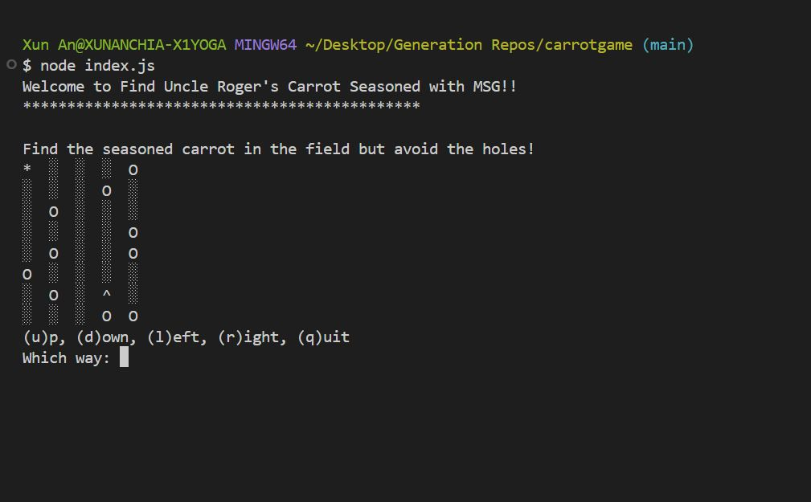
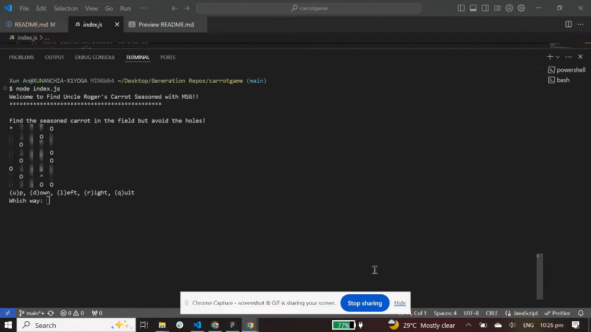

<h2 align="center">jsassessment (Find Uncle Roger's Carrot Seasoned with MSG!!)</h2>

Javascript Assessment for FSD-04 (Generation)

Based off 'Find Your Hat' game on Codeacademy

To clone Git repo to initialize/play on Git Terminal using node index.js

---

**Game Start**

**Gameplay**

---
